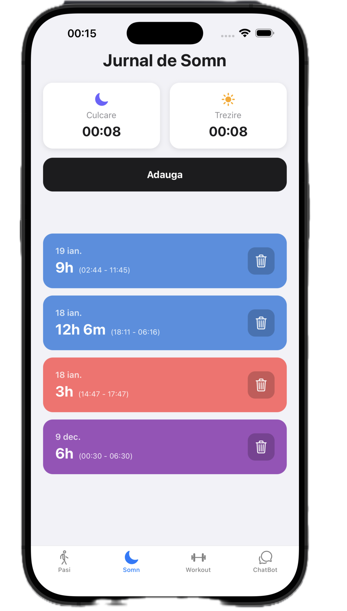
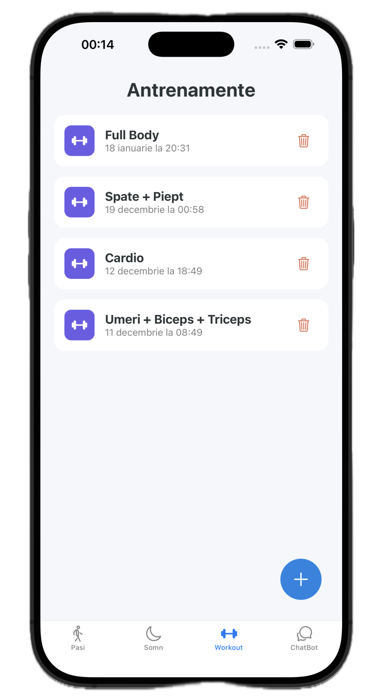
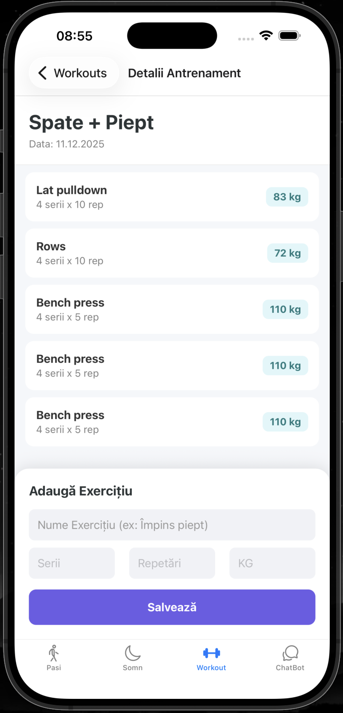

# HealthTracker - Monitorizare Sănătate & Asistență AI

**HealthTracker** este o aplicație mobilă modernă creată pentru a facilita monitorizarea activității fizice, a somnului și a sănătății generale. Aceasta integrează un asistent AI bazat pe tehnologia GPT pentru a oferi recomandări personalizate de stil de viață.

### Interfața Aplicației

| Monitorizare Somn | Listă Antrenamente | Detalii Antrenament |
| :---: | :---: | :---: |
|  |  |  |
| *Înregistrare somn* | *Istoric sesiuni* | *Exerciții specifice* |
---

## Funcționalități Cheie

Aplicația oferă patru module principale de monitorizare și asistență:

* **📊 Monitorizare Pași**: Înregistrează numărul de pași, permite vizualizarea progresului zilnic și setarea de obiective.
* **😴 Tracking Somn**: Jurnal pentru orele de culcare și trezire, cu calcul automat al duratei sesiunii de odihnă.
* **💪 Gestionare Antrenamente**: Crearea de antrenamente personalizate pe categorii și adăugarea de exerciții specifice.
* **🤖 ChatBot AI**: Asistent virtual bazat pe GPT-3.5 Turbo care răspunde la întrebări despre fitness și nutriție.

---

## Structura Proiectului

### Backend

```text
backend/src/main/java/com/healthtracker/
├── Controllers/            # Gestionarea cererilor HTTP (Entry Points)
│   ├── AiController.java      # Integrare OpenAI GPT-3.5
│   ├── SleepController.java   # Logica pentru monitorizarea somnului
│   ├── StepsController.java   # Gestionarea datelor de activitate (pași)
│   └── WorkoutController.java # Managementul sesiunilor de antrenament
├── Entities/               # Modelele de date (Mapează tabelele PostgreSQL)
│   ├── SleepSession.java      # Atribute: startTime, endTime, duration
│   ├── DailySteps.java        # Atribute: date, stepCount, goal
│   ├── Workout.java           # Atribute: type, date, duration
│   └── Exercise.java          # Atribute: name, reps, sets
└── Repositories/            # Interfețe de acces la date (Spring Data JPA)
    ├── SleepRepository.java   # Interogări pentru sesiunile de somn
    ├── StepsRepository.java   # Gestiunea persistentei pentru pași
    └── WorkoutRepository.java # Gestiunea persistentei pentru antrenamente
```
* **Backend**: Java cu framework-ul Spring Boot
* **Frontend**: React Native și Expo pentru o experiență cross-platform (iOS).
* **Bază de Date**: PostgreSQL pentru stocarea datelor.
* **AI**: Integrare OpenAI API pentru asistență virtuală.

### Organizarea Backend-ului (Spring Boot)
* **Controllers**: Gestionează punctele de acces API (Endpoints).
* **Entities**: Modelele de date care mapează tabelele din baza de date (SleepSession, Workout).
* **Repositories**: Interfețe pentru comunicarea directă cu PostgreSQL prin JPA.

---

## Fluxul de Date (Exemplu: Adăugare Antrenament)

1.  **Frontend**: Utilizatorul introduce datele, iar aplicația trimite o cerere HTTP POST cu un obiect JSON.
2.  **Backend**: `WorkoutController` recepționează cererea și validează datele.
3.  **Persistență**: Datele sunt salvate în baza de date PostgreSQL prin Repository.
4.  **Confirmare**: Serverul returnează obiectul salvat, iar interfața mobilă afișează succesul operațiunii.

---
